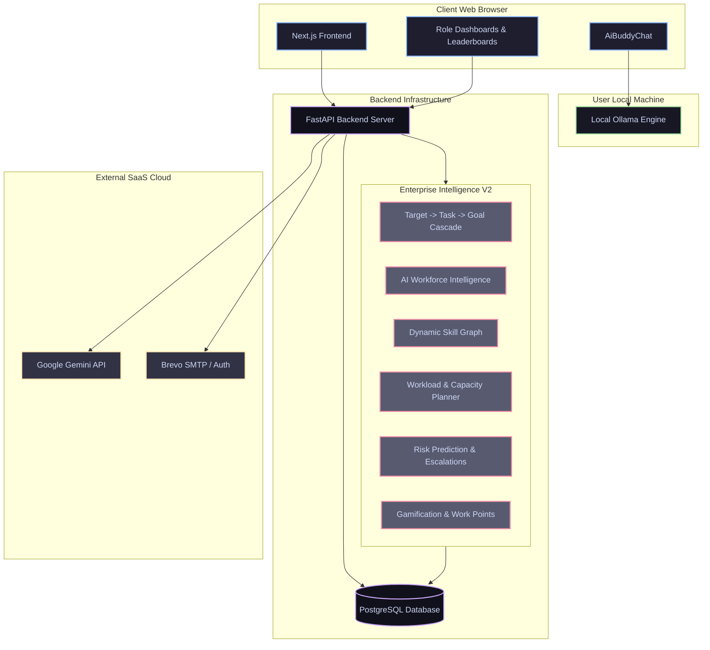

# GoalForge AI

<p align="center">
  <strong>The Intelligent OKR and Performance Management Platform</strong>
</p>

<p align="center">
  
  
  
  
  
</p>

---

## Overview

GoalForge AI is an advanced, highly scalable OKR (Objectives and Key Results) and Performance Management platform. Built for modern teams, it enables employees to set ambitious goals, managers to oversee progress, and administrators to gain system-wide insights.

What sets GoalForge AI apart is its Dual-Engine Hybrid AI System. You can leverage Google Gemini for cloud-based reasoning, or run locally via Ollama for absolute privacy and zero-cost inference. Combined with our intelligent burnout and goal prediction heuristics, GoalForge AI acts as a proactive coach for your entire organization.

---

## System Architecture

GoalForge AI operates on a strictly isolated tier system. The FastAPI backend securely handles business logic, state persistence, and proxies cloud AI requests. Meanwhile, the Next.js frontend communicates directly with your local Ollama engine for private local AI tasks, entirely bypassing backend infrastructure when dealing with sensitive local queries.



---

## Core Features

### 1. Role-Based Workspaces
Every user receives a tailored experience based on their permissions. Employees can draft goals, track milestones, and converse with their AI Coach. Managers are provided a dedicated portal to approve goals, escalate risks, and monitor workload. Administrators retain full control over the directory, security settings, and system metrics.

### 2. Intelligent Goal Lifecycle
Create dynamic goals with defined priorities, deadlines, and alignment weights. Break them down into interactive milestones that automatically calculate progress. A strict approval pipeline ensures teams stay perfectly aligned with management expectations.

### 3. Dual-Engine Hybrid AI Coach
A powerful performance assistant built with flexibility in mind. 
*   **Cloud Mode (Google Gemini)**: Refine goals, create action plans, parse resumes, and auto-assign tasks using the fast Gemini 2.5 models. Requests are securely routed through the backend or passed end-to-end securely from the browser.
*   **Local Mode (Ollama)**: Communicate directly from the browser to your local machine. We bypass strict browser CORS preflight restrictions using text/plain payload streaming, allowing secure localhost connections even from production environments. 
*   **Bring Your Own Key**: Users can securely store their own Gemini API keys in the browser. This key is end-to-end encrypted in transit and seamlessly overrides the application default, allowing individual team members to utilize their personal AI quotas for tasks like Skill Parsing and Auto Assignment directly from the UI.
*   **Anti-Spam Rate-Limiter**: Enforces a strict 12-second client-side cooldown between consecutive local requests to protect local hardware from high-load spikes.

### 4. Enterprise Workforce Intelligence
*   **Target to Goal Cascades**: Seamlessly break down large organizational targets into manager tasks, and further into employee goals, with automatic upward progress synchronization.
*   **AI Auto-Assignment**: Explainable AI evaluates historic completion rates, current workload, and required skills to intelligently match managers to targets and employees to tasks.
*   **Dynamic Skill Graph**: Skills evolve based on completed tasks, resulting in a verified confidence score for every capability an employee holds.
*   **Automated Resume Parsing**: Instantly extract baseline skills and experience from uploaded PDFs or DOCX files natively into the skill profile using your choice of local or cloud AI models.
*   **Predictive Analytics**: The system evaluates update frequency, milestone density, and deadlines to calculate the likelihood of success. The Burnout Risk Detection system scans for over-allocation and high-priority concentrations, alerting managers proactively.

### 5. Enterprise-Grade Security
Engineered to adhere to high-grade corporate security standards:
*   Secure passwordless email authentication via SMTP, protected by brute-force progressive lockouts.
*   All routes are guarded by Dual-Enforced Role Isolation (RBAC) checking JWT signatures at multiple layers.
*   Explicit protections against IDOR vulnerabilities and stringent data-ownership checks across milestones, check-ins, and performance narratives.
*   Pydantic data validation with aggressive input sanitization to prevent XSS.
*   Cryptographic audit trails for all critical operations.

---

## Technology Stack

### Frontend
*   **Framework**: Next.js 14 (App Router)
*   **Styling**: Modern CSS with deep glassmorphic visuals
*   **State Management and Utilities**: React Hooks, Axios, Lucide Icons, Mermaid.js

### Backend
*   **Framework**: FastAPI (Python 3.11+)
*   **Database ORM**: SQLAlchemy (Asynchronous execution with asyncpg)
*   **Security**: JOSE (JWT authentication), bcrypt (password hashing), CORS Middleware, Python secrets (CSPRNG OTP)

### Infrastructure
*   **Database**: PostgreSQL 16
*   **Orchestration**: Multi-stage Docker Compose
*   **Production Hosting**: Next.js (Vercel), FastAPI (Render), PostgreSQL (Neon / Supabase)

---

## Quick Start Guide

### Prerequisites
Make sure you have the following installed on your machine:
*   Node.js (v18+)
*   Python (3.11+)
*   PostgreSQL (v16+) (Or Docker)
*   Ollama (Optional, for local private AI capability)

### 1. Clone the Repository
```bash
git clone https://github.com/beastspirit2005/GoalForge_Ai-.git
cd GoalForge-Ai
```

### 2. Running with Docker (Recommended)
You can start the entire stack (Frontend, Backend, Database) with a single command:
```bash
docker compose up --build -d
```
The frontend will be available at http://localhost:3000 and the backend API at http://localhost:8000. PostgreSQL is mapped to port 5433 on your host to avoid conflicts.

### 3. Manual Local Installation

#### Database Setup
Open your PostgreSQL terminal and create the database:
```sql
CREATE DATABASE goalforge;
```

#### Backend Setup
1. Navigate to the backend directory: `cd backend`
2. Create and activate a Python virtual environment:
   ```bash
   python -m venv venv
   # On Windows (PowerShell): venv\Scripts\Activate.ps1
   # On Linux/macOS: source venv/bin/activate
   ```
3. Install dependencies: `pip install -r requirements.txt`
4. Run the database seed script to add standard roles and starter data: `python scripts/seed.py`
5. Start the FastAPI server: `uvicorn app.main:app --reload --port 8000`

#### Frontend Setup
1. Navigate to the frontend directory: `cd frontend`
2. Install dependencies: `npm install`
3. Run the development server: `npm run dev -- --port 3000`
4. Access the web interface at http://localhost:3000

---

## Production vs. Demo Gating (DEMO_MODE)

For security compliance, GoalForge AI restricts the exposure of One-Time Password (OTP) codes in API responses. By default, OTP codes are never returned in HTTP responses. Attempting to request an OTP when SMTP is unconfigured will result in a 500 error, enforcing secure transactional mail pathways in production.

To run interactive preview deployments without email relays, set the following environment variable in the backend:
```env
DEMO_MODE=TRUE
```
When active, the backend returns the generated OTP code directly in the response payload for easy local testing.

---

## Ollama Local AI CORS Configuration

To allow the browser frontend to make local inference calls directly to your machine's Ollama server, avoiding proxy latencies, you must allow CORS origins in Ollama.

*   **Windows**: Close Ollama, open PowerShell, run `[System.Environment]::SetEnvironmentVariable('OLLAMA_ORIGINS', '*', 'User')`, and launch Ollama again.
*   **macOS / Linux**: Run Ollama with the environment variable set: `OLLAMA_ORIGINS="*" ollama serve`

---

## Demo Access Credentials

Get started instantly using our pre-seeded simulation profiles:

*   **Administrator**: `admin@example.com` | `password123`
*   **L1 Manager**: `manager@example.com` | `password123`
*   **Employee**: `employee@example.com` | `password123`

---

## License

GoalForge AI is built for professional OKR tracking, advanced interactive dashboards, and modern cloud deployment demonstration. All Rights Reserved. Built by GoalForge Devs.
