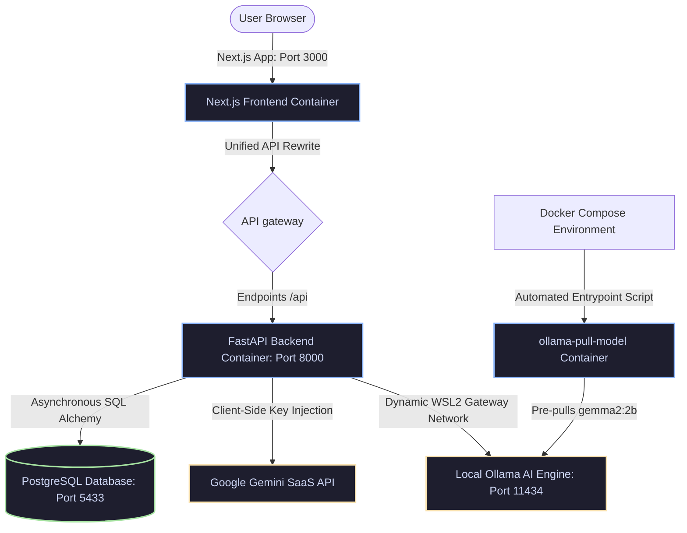

# GoalForge AI

**AI-Powered OKR Management and Performance Intelligence Platform**

GoalForge AI is an advanced, enterprise-grade platform designed to align organizational goals, track quarterly progress, and predict workforce trends. Powered by a high-throughput **FastAPI** backend, a responsive **Next.js** frontend, and a **hybrid cognitive model orchestration layer** (supporting Google Gemini and local Ollama edge servers), it bridges the gap between traditional enterprise management and modern AI analytics.

---

## System Architecture

GoalForge AI utilizes a highly decoupled, containerized multi-service architecture designed for absolute performance, privacy-first computing, and seamless developer onboarding.



---

## What is New and Enterprise-Ready

GoalForge AI is packed with non-trivial engineering solutions designed to impress hiring managers and solve genuine corporate needs:

*   **Comprehensive Admin User Management**: Full CRUD capabilities for administrators, featuring an inline edit dialog to securely modify employee roles, departments, names, and active statuses with real-time audit logging and state hydration.
*   **5-Column Categorized Governance Audit Logs**: Replaces standard flat-list logging with a sleek, CSS-Grid 5-column layout separating events into User Accounts, Goal Creation, Goal Rejections, Goal Approvals, and Escalations. Features global search and date-filtering across all categories simultaneously.
*   **Strict Role-Based Security Isolation**: Fully hardened React route guards and backend middleware pathways. L1 Managers and Administrators are strictly isolated from employee consoles, automatically hiding and blocking access to sensitive API endpoints.
*   **Algorithmic Heuristics Engine**: Replaces slow, resource-heavy neural networks with an optimized, pure-mathematics predictive engine that calculates completion probability and employee burnout risk in microseconds (see [Prediction Engine](#prediction-heuristics)).
*   **Dynamic Context & Goal Mappings**: Goals, approvals, and escalations dynamically bind to the active session's user token and manager ID context, entirely replacing static mock data rendering.
*   **PostgreSQL Sequence Synchronization**: Automated table sequence resetting to safely accommodate pre-seeded demo data without triggering auto-increment ID collisions during new user registrations.
*   **Interactive In-Line Approvals & Escalation Pipes**: Allows managers to tweak goal descriptions directly inside their approval table. Rejected or modified goals can be instantly escalated to the Admin console via a compliant glassmorphic pipeline.
*   **Role-Aware AI Copilot Chat Drawer**: A persistent, floating dashboard assistant providing context-aware goal refinement. Supports multi-provider toggles and user-scoped data privacy switches.

---

## Prediction Heuristics

Rather than training a costly, lag-heavy machine learning model, GoalForge AI relies on a **high-speed, deterministic heuristic mathematical model** inside `backend/app/ai/prediction_engine.py` to analyze performance trends:

### Goal Completion Probability ($40\% / 20\% / 15\% / 15\% / 10\%$)
$$P(\text{Completion}) = (R_{\text{progress}} \times 0.40) + (T_{\text{milestone}} \times 0.20) + (W_{\text{load}} \times 0.15) + (U_{\text{recency}} \times 0.15) + (P_{\text{priority}} \times 0.10)$$

*   **Progress Rate ($40\%$):** Real vs. expected progress relative to the remaining deadline. Penalizes overdue tasks.
*   **Milestone Trajectory ($20\%$):** The percentage of weekly intermediate milestones actively completed.
*   **Workload Pressure ($15\%$):** Multi-goal tax (overloading employees with $>6$ goals reduces efficiency).
*   **Update Recency ($15\%$):** Freshness index—stale goals that haven't been updated in $>14$ days are flagged as high risk.
*   **Goal Priority ($10\%$):** Focus weight—high-impact/high-weightage goals receive higher priority attention.

### Employee Burnout Risk
Calculated dynamically based on active work allocations:
*   **Goal Overload ($30\%$):** Too many simultaneous targets.
*   **Progress Pressure ($25\%$):** Falling behind on high-priority goals.
*   **Weightage Burden ($15\%$):** Allocating $>100\%$ weightage.
*   **Check-in Exhaustion ($15\%$):** Compulsive daily updates indicating micromangement or stress.
*   **Risk Accumulation ($15\%$):** Multiple high-risk/delayed goals compounding.

---

## Hybrid AI Connectivity and Privacy-First Design

GoalForge AI implements a production-grade dual-AI orchestrator wrapper inside `backend/app/ai/gemini_client.py`:

1.  **Cloud-based Cognitive Engine:** Utilizing **Google Gemini 2.0 Flash** for fast, complex milestones. 
    *   *Privacy Protocol:* API keys are injected at the browser layer and stored locally in `localStorage` rather than database tables. They are passed securely in API headers, ensuring your personal SaaS tokens never persist on foreign servers.
2.  **Sovereign Local-First Engine:** Powered by **Ollama** running locally on the user's host machine. Supports lightweight edge models (`gemma2:2b`, `llama3`, `mistral`).
    *   *Failover System:* If no API key is provided and Ollama is offline, the backend transparently triggers a local rules-based fallback AI to ensure continuous service.

---

## Docker Deployment and Network Tuning

The entire stack is containerized, utilizing custom network bridges and database configurations optimized for native operating systems.

### Anti-Port-Conflict DB Mapping
Windows and macOS developers frequently run a local instance of PostgreSQL on the host port `5432`. To avoid container initialization crashes, GoalForge AI bridges the Docker Postgres instance to host port **`5433`**, while maintaining internal container-to-container queries on the default port `5432`.

### Cross-Namespace Ollama Communication (WSL2 Gateway)
When running Docker on Windows/macOS, `127.0.0.1` inside a container points to that specific container's namespace—making the native host's Ollama service unreachable. GoalForge AI overrides this by dynamically mapping a bridge gateway `host.docker.internal` within the backend service, instantly resolving host-based local models without manual configuration:

```yaml
backend:
  environment:
    OLLAMA_HOST: http://host.docker.internal:11434
  extra_hosts:
    - "host.docker.internal:host-gateway"
```

---

## Quick Start

### Prerequisites
*   **Node.js 18+** & **Python 3.11+**
*   **PostgreSQL 16+** (Or Docker)
*   **Ollama** (Optional, for private offline AI)

### 1. Clone the Repository
```bash
git clone https://github.com/beastspirit2005/GoalForge_Ai-.git
cd GoalForge-Ai
```

### 2. Rapid Multi-Container Startup (Docker Compose)
Launch the database, frontend, backend, and local model-pulling engine with a single command:
```bash
docker compose up -d
```
*   **Automatic Bootloader:** On startup, the container system executes `ollama-pull-model`, which polls the Ollama server and auto-downloads the lightweight `gemma2:2b` model.
*   **Pre-Built Registries:** Re-compiled production images are loaded directly from Docker Hub:
    *   [1065925/goalforge-backend](https://hub.docker.com/r/1065925/goalforge-backend)
    *   [1065925/goalforge-frontend](https://hub.docker.com/r/1065925/goalforge-frontend)

### 3. Manual Local Installation
If you prefer running the servers natively:

#### A. Database Setup
```bash
createdb goalforge
# Or via psql shell:
psql -U postgres -c "CREATE DATABASE goalforge;"
```

#### B. Asynchronous Python Backend Setup
```bash
cd backend
python -m venv venv
venv\Scripts\activate       # On Windows
# source venv/bin/activate  # On macOS/Linux

pip install -r requirements.txt
# Populate .env inside /backend (use .env.example)
uvicorn app.main:app --reload --port 8000
```

#### C. Next.js Frontend Setup
```bash
cd ../frontend
npm install
npm run dev -- --port 3000
```

#### D. Seed Demo Data
```bash
cd ../backend
python scripts/seed.py
```

---

## Demo Credentials

| Role | Email | Password |
|:---|:---|:---|
| **Employee** | `employee@goalforge.ai` | `password123` |
| **L1 Manager** | `manager@goalforge.ai` | `password123` |
| **Administrator** | `admin@goalforge.ai` | `password123` |

---

## Project Blueprint

```
GoalForge-Ai/
├── docker-compose.yml   # Multi-container orchestration config
├── vercel.json          # Monorepo deployment mappings
├── backend/
│   ├── app/
│   │   ├── ai/          # Heuristic math engine & multi-provider client wrapper
│   │   ├── core/        # DB sessions and token authentication setup
│   │   ├── models/      # SQLAlchemy ORM models (Goals, Check-ins, Audits)
│   │   ├── routes/      # Isolated REST controllers (Admin, Approvals, AI)
│   │   └── main.py      # App initializers and static asset drivers
│   └── Dockerfile       # Backend optimized build config
├── frontend/
│   ├── src/
│   │   ├── app/         # Next.js App Router UI pages
│   │   ├── components/  # Floating copilot chat drawer & dashboard tables
│   │   └── services/    # Browser API proxy controllers
│   └── Dockerfile       # Next.js multi-stage build configuration
```

---

## License
Created for advanced enterprise OKR evaluation, hackathon submissions, and software portfolio demonstration. Proprietary license. Built by GoalForge Devs.
