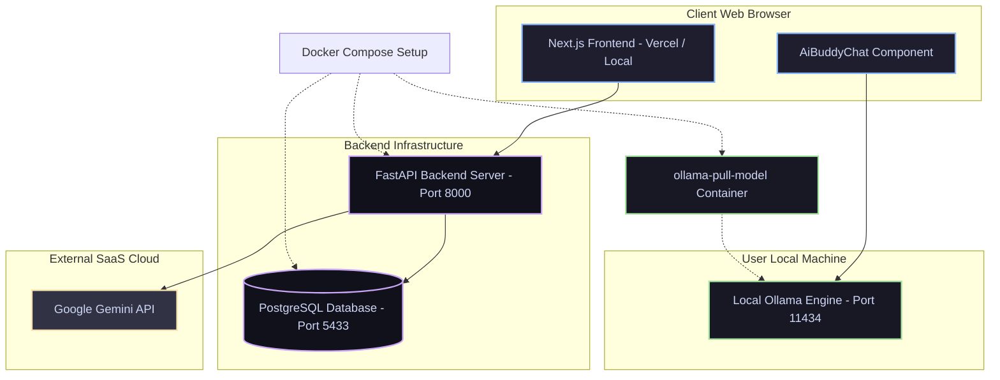

# GoalForge AI

<p align="center">
  <strong>The Ultimate Intelligent OKR and Performance Management Platform</strong>
</p>

<p align="center">
  
  
  
  
  
</p>

---

## Overview

GoalForge AI is a state-of-the-art, secure, and highly scalable OKR (Objectives and Key Results) and Performance Management platform. Designed for modern corporate structures, it empowers employees to forge ambitious goals, L1 managers to seamlessly govern progress and approvals, and administrators to orchestrate user operations, view security audits, and glean system-wide insights.

GoalForge AI stands out with its Dual-Engine Hybrid AI System (leveraging Google Gemini for high-fidelity SaaS-based reasoning and local Ollama for private, client-side, zero-cost inference) and its intelligent Burnout and Goal Completion Prediction Heuristics.

---

## System Architecture

GoalForge AI's architecture is built on strict tier isolation and a hybrid AI layout. While the FastAPI backend securely handles business transactions, state persistence, and proxying cloud AI requests, the Next.js Frontend communicates directly with your local Ollama engine to deliver seamless local AI chats without loading backend infrastructure or exposing private data to external clouds.



---

## Major Features Highlight

### 1. Multi-Role Interactive Dashboards
Role-based dashboards create dedicated, personalized interfaces with specific workflows tailored to individual permissions:
*   **Employee Workspace:** Draft, edit, and track personal goals, log progress milestones, check prediction metrics, and chat with the AI Coach.
*   **Manager Portal:** Review team-wide goals, issue approvals or rejections, escalate objectives, and analyze individual workload profiles.
*   **Admin Console:** Maintain directory control over employees, assign roles (Admin, L1 Manager, Employee), enable/disable accounts, and review system metrics.

---

### 2. Complete OKR and Goal Lifecycle Governance
Manage key results and objectives dynamically:
*   **Comprehensive Goal Metrics:** Define start/end dates, priorities (High, Medium, Low), statuses (Draft, Pending Approval, Approved, Rejected, Escalated), and alignment weight.
*   **Interactive Milestones:** Break down goals into modular milestones that automatically calculate progress weights as they are ticked off.
*   **Approval Pipeline:** A rigid workflow ensuring employees submit goals to their designated manager, keeping expectations aligned.

---

### 3. Smart Dual-Engine Hybrid AI Coach
A powerful performance assistant built with privacy, flexibility, and reliability in mind:
*   **Cloud Mode (Google Gemini):** Uses secure backend-to-SaaS communication to refine goals, create action plans, and coach employees.
*   **Private Local Mode (Ollama):** Directly communicates from the browser to the user's local Ollama instance (typically using gemma2:2b). 
    > [!IMPORTANT]
    > **Chrome PNA Bypass:** To allow a production Vercel frontend (HTTPS) to securely access a local Ollama instance (HTTP) without triggering Chrome's strict Private Network Access (PNA) CORS preflight blocks, GoalForge AI streams payloads using text/plain formatting, allowing seamless browser-to-localhost connections!
    *   **Anti-Spam Cooldown Rate-Limiter:** Enforces a strict 12-second client-side cooldown between consecutive requests (with an interactive, real-time UI countdown) to protect the local CPU/GPU from high-load spikes and concurrent execution freezes.
    *   **Lightweight Resource Footprint:** Configures context limit (`num_ctx: 2048`) and token output generation boundaries (`num_predict: 250`) inside the Ollama prompt payload, keeping VRAM/RAM footprints ultra-lightweight for lower-spec everyday computers.
*   **Rule-Based Fallback:** If both cloud and local AI systems are offline, a fallback heuristics engine steps in to provide deterministic advice so your work is never interrupted.

---

### 4. Smart Heuristics and Predictive Insights
GoalForge AI goes beyond static status indicators to provide proactive performance metrics:
*   **Completion Probability Index:** Evaluates update frequency, milestone density, workload distribution, and goal deadlines to calculate the likelihood of timely completion.
*   **Burnout Risk Detection:** Scans over-allocation, overdue milestones, and high priority concentrations to alert managers before team members burn out.

---

### 5. Enterprise Security, Audits and Observability
Engineered to adhere to high-grade corporate security compliance:
*   **Rigid Role Isolation:** Route guards and dependency injection in the backend verify JSON Web Tokens (JWT) and evaluate exact role access.
*   **Comprehensive Audit Logs:** Chronological record of critical operations—account creations, status changes, approvals, rejections, and escalations—providing clear, immutable accountability.
*   **Production Observability:** Active request tracing (X-Trace-ID), server-side rate limits, database pools, and continuous system health checks.

---

## Technology Stack

### Frontend
*   **Framework:** Next.js 14 (App Router)
*   **Styling:** Modern CSS with deep glassmorphic visuals
*   **State Management and Utilities:** React Hooks, Axios, Lucide Icons, Mermaid.js

### Backend
*   **Framework:** FastAPI (Python 3.11+)
*   **Database ORM:** SQLAlchemy (Asynchronous execution with asyncpg)
*   **Security:** JOSE (JWT authentication), passlib (bcrypt hashing), CORS Middleware

### Infrastructure
*   **Database:** PostgreSQL 16
*   **Orchestration:** Multi-stage Docker Compose
*   **Production Hosting:** Next.js (Vercel), FastAPI (Render), PostgreSQL (Supabase / Render Managed)

---

## Quick Start Guide

### Prerequisites
Make sure you have the following installed on your machine:
*   Node.js (v18+)
*   Python (3.11+)
*   PostgreSQL (v16+) (Or Docker)
*   Ollama (Optional, for local private AI capability)

---

### 1. Clone the Repository
```bash
git clone https://github.com/beastspirit2005/GoalForge_Ai-.git
cd GoalForge-Ai
```

---

### 2. Running with Docker (Recommended)
You can start the entire stack (Frontend, Backend, Database, and an automated helper container that pre-pulls the Ollama models) with a single command:
```bash
docker compose up --build -d
```
*   The frontend will be available at http://localhost:3000
*   The backend API will run at http://localhost:8000
*   PostgreSQL is mapped to port 5433 on your host to avoid conflicts with existing database instances.

---

### 3. Manual Local Installation
If you prefer running the components natively on your system:

#### A. Setup the Database
1. Open your PostgreSQL terminal and create the database:
   ```sql
   CREATE DATABASE goalforge;
   ```

#### B. Launch the Backend API
1. Navigate to the backend directory:
   ```bash
   cd backend
   ```
2. Create and activate a Python virtual environment:
   ```bash
   python -m venv venv
   # On Windows (PowerShell):
   venv\Scripts\Activate.ps1
   # On Linux/macOS:
   source venv/bin/activate
   ```
3. Install dependencies:
   ```bash
   pip install -r requirements.txt
   ```
4. Run database seed script (adds standard roles, users, and starter goals):
   ```bash
   python scripts/seed.py
   ```
5. Start the FastAPI development server:
   ```bash
   uvicorn app.main:app --reload --port 8000
   ```

#### C. Launch the Next.js Frontend
1. Open a new terminal and navigate to the frontend directory:
   ```bash
   cd frontend
   ```
2. Install dependencies:
   ```bash
   npm install
   ```
3. Run the development server:
   ```bash
   npm run dev -- --port 3000
   ```
4. Access the web interface at http://localhost:3000

---

## Demo Access Credentials

Get started instantly using our pre-seeded simulation profiles:

| System Role | Username / Email | Password | Access Capabilities |
| :--- | :--- | :--- | :--- |
| **Administrator** | `admin@goalforge.ai` | `password123` | Control User Accounts, Audit Trails, Operations |
| **L1 Manager** | `manager@goalforge.ai` | `password123` | Goal Approvals, Team Statistics, Risk Analytics |
| **Employee** | `employee@goalforge.ai` | `password123` | Personal Goal Creation, Milestone Logging, AI Chats |

---

## Ollama Local AI CORS Configuration

To let the browser frontend make local inference calls directly to your machine's Ollama server (avoiding proxy latencies), you must allow CORS origins in Ollama.

### Configuration Guide
*   **Windows:**
    1. Close Ollama from the System Tray.
    2. Open PowerShell and run:
       ```powershell
       [System.Environment]::SetEnvironmentVariable('OLLAMA_ORIGINS', '*', 'User')
       ```
    3. Launch Ollama again.
*   **macOS / Linux:**
    Run Ollama with the environment variable set:
    ```bash
    OLLAMA_ORIGINS="*" ollama serve
    ```

---

## Project Directory Structure

```text
GoalForge-Ai/
├── docker-compose.yml       # Production/Local docker multi-container spec
├── vercel.json              # Vercel Serverless & rewrite routing controls
├── backend/
│   ├── app/
│   │   ├── ai/              # AI Clients (Gemini & Fallbacks) & Burnout Heuristics
│   │   ├── core/            # Database Session, Config, JWT Security, & Hashing
│   │   ├── middleware/      # Rate Limits, Execution Logging, & Custom Header Tracing
│   │   ├── models/          # SQLAlchemy Database Schemas
│   │   ├── routes/          # API Handlers (Users, Goals, Audits, Analytics)
│   │   └── main.py          # FastAPI Main Engine Initialization
│   ├── scripts/             # Seeding tools & utilities
│   └── Dockerfile
├── frontend/
│   ├── src/
│   │   ├── app/             # Next.js App Router (Page views & Layouts)
│   │   ├── components/      # Role Dashboards, Goal Management, AiBuddyChat
│   │   ├── lib/             # API Connectors, Local State, browser logs
│   │   └── services/        # Next.js API Wrappers
│   └── Dockerfile
└── scripts/                 # System stability check and setup automations
```

---

## License and Contact

GoalForge AI is built for professional OKR tracking, advanced interactive dashboards, and modern cloud deployment demonstration. All Rights Reserved. Built by GoalForge Devs.
