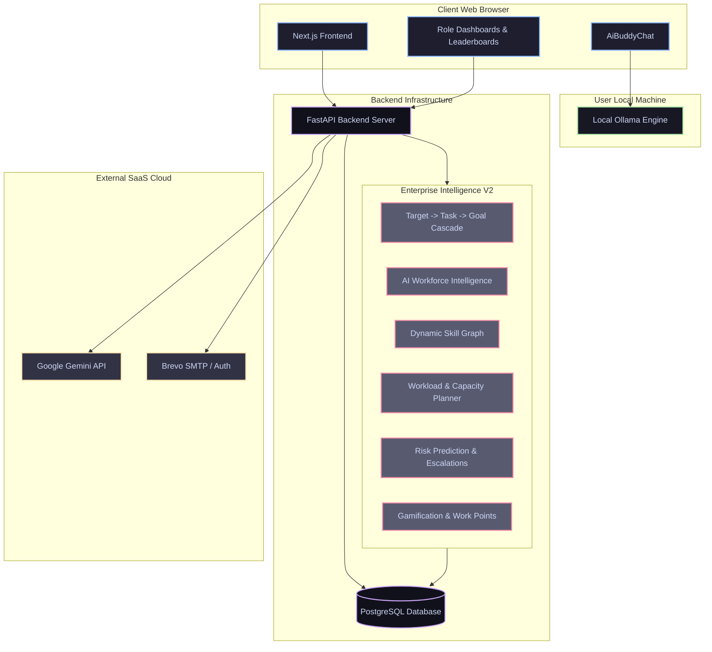

# GoalForge AI

<p align="center">
  <strong>The Ultimate Intelligent OKR and Performance Management Platform</strong>
</p>

<p align="center">
  
  
  
  
  
</p>

---

## Overview

GoalForge AI is a state-of-the-art, secure, and highly scalable OKR (Objectives and Key Results) and Performance Management platform. Designed for modern corporate structures, it empowers employees to forge ambitious goals, L1 managers to seamlessly govern progress and approvals, and administrators to orchestrate user operations, view security audits, and glean system-wide insights.

GoalForge AI stands out with its Dual-Engine Hybrid AI System (leveraging Google Gemini for high-fidelity SaaS-based reasoning and local Ollama for private, client-side, zero-cost inference) and its intelligent Burnout and Goal Completion Prediction Heuristics.

---

## System Architecture

GoalForge AI's architecture is built on strict tier isolation and a hybrid AI layout. While the FastAPI backend securely handles business transactions, state persistence, and proxying cloud AI requests, the Next.js Frontend communicates directly with your local Ollama engine to deliver seamless local AI chats without loading backend infrastructure or exposing private data to external clouds.



---

## Major Features Highlight

### 1. Multi-Role Interactive Dashboards
Role-based dashboards create dedicated, personalized interfaces with specific workflows tailored to individual permissions:
*   **Employee Workspace:** Draft, edit, and track personal goals, log progress milestones, check prediction metrics, and chat with the AI Coach.
*   **Manager Portal:** Review team-wide goals, issue approvals or rejections, escalate objectives, and analyze individual workload profiles.
*   **Admin Console:** Maintain directory control over employees, assign roles (Admin, L1 Manager, Employee), enable/disable accounts, and review system metrics.

---

### 2. Complete OKR and Goal Lifecycle Governance
Manage key results and objectives dynamically:
*   **Comprehensive Goal Metrics:** Define start/end dates, priorities (High, Medium, Low), statuses (Draft, Pending Approval, Approved, Rejected, Escalated), and alignment weight.
*   **Interactive Milestones:** Break down goals into modular milestones that automatically calculate progress weights as they are ticked off.
*   **Approval Pipeline:** A rigid workflow ensuring employees submit goals to their designated manager, keeping expectations aligned.

---

### 3. Smart Dual-Engine Hybrid AI Coach
A powerful performance assistant built with privacy, flexibility, and reliability in mind:
*   **Cloud Mode (Google Gemini):** Uses secure backend-to-SaaS communication to refine goals, create action plans, and coach employees.
*   **Private Local Mode (Ollama):** Directly communicates from the browser to the user's local Ollama instance (typically using gemma2:2b). 
    > [!IMPORTANT]
    > **Chrome PNA Bypass:** To allow a production Vercel frontend (HTTPS) to securely access a local Ollama instance (HTTP) without triggering Chrome's strict Private Network Access (PNA) CORS preflight blocks, GoalForge AI streams payloads using text/plain formatting, allowing seamless browser-to-localhost connections!
    *   **Anti-Spam Cooldown Rate-Limiter:** Enforces a strict 12-second client-side cooldown between consecutive requests (with an interactive, real-time UI countdown) to protect the local CPU/GPU from high-load spikes and concurrent execution freezes.
    *   **Lightweight Resource Footprint:** Configures context limit (`num_ctx: 2048`) and token output generation boundaries (`num_predict: 250`) inside the Ollama prompt payload, keeping VRAM/RAM footprints ultra-lightweight for lower-spec everyday computers.
*   **Rule-Based Fallback:** If both cloud and local AI systems are offline, a fallback heuristics engine steps in to provide deterministic advice so your work is never interrupted.

---

### 4. Smart Heuristics and Predictive Insights
GoalForge AI goes beyond static status indicators to provide proactive performance metrics:
*   **Completion Probability Index:** Evaluates update frequency, milestone density, workload distribution, and goal deadlines to calculate the likelihood of timely completion.
*   **Burnout Risk Detection:** Scans over-allocation, overdue milestones, and high priority concentrations to alert managers before team members burn out.

---

### 5. Enterprise Security, Audits and Observability
Engineered to adhere to high-grade corporate security compliance:
*   **Secure Email OTP Authentication:** Features passwordless login fallback and account verification via Brevo SMTP. OTP codes are generated using Python's `secrets` module (OS-level CSPRNG), ensuring cryptographic unpredictability.
*   **OTP Brute-Force Protection:** Every failed OTP attempt immediately wipes the code from the database (forcing a re-request) and increments a persistent failure counter. After 3 failed attempts, a **progressive lockout** activates:

    | Lockout # | Duration | Unlock Method |
    | :--- | :--- | :--- |
    | 1st | 5 minutes | Auto-unlock |
    | 2nd | 10 minutes | Auto-unlock |
    | 3rd | 15 minutes | Auto-unlock |
    | 4th+ | Permanent | Admin must re-enable |

*   **Secure Password-Change Routing:** The `/auth/change-password` endpoint explicitly invalidates active OTP codes and wipes all progressive lockout strikes and lock timers, ensuring complete session coherence.
*   **Dual-Enforced Role Isolation (RBAC):** Route guards via `Depends(require_role)` and a global `RoleMiddleware` fallback verify JSON Web Tokens (JWT) and evaluate exact role access at two independent layers.
*   **IDOR and Broken Access Control Protections:** Enforces data-level ownership check on milestones, check-ins, and AI coaching narrative routes. Restricts manager views to direct reportees, and sanitizes admin inputs with explicit Pydantic schemas to avoid unauthorized user updates.
*   **New User Approval Workflow:** Self-registered accounts require an explicit Admin or Manager approval before gaining system access, preventing unauthorized data exposure.
*   **Comprehensive Audit Logs:** Chronological record of critical operations—account creations, status changes, approvals, rejections, and escalations—providing clear, immutable accountability.
*   **Production Observability:** Active request tracing (X-Trace-ID), server-side Redis sliding-window rate limits (evaluating `X-Forwarded-For` proxy headers behind load balancers/ingress), database pools, and continuous system health checks.


---

## Technology Stack

### Frontend
*   **Framework:** Next.js 14 (App Router)
*   **Styling:** Modern CSS with deep glassmorphic visuals
*   **State Management and Utilities:** React Hooks, Axios, Lucide Icons, Mermaid.js

### Backend
*   **Framework:** FastAPI (Python 3.11+)
*   **Database ORM:** SQLAlchemy (Asynchronous execution with asyncpg)
*   **Security:** JOSE (JWT authentication), bcrypt (password hashing), CORS Middleware, `secrets` (CSPRNG OTP)

### Infrastructure
*   **Database:** PostgreSQL 16
*   **Orchestration:** Multi-stage Docker Compose
*   **Production Hosting:** Next.js (Vercel), FastAPI (Render), PostgreSQL (Supabase / Render Managed)
*   **DevOps Automations:** Custom Python subprocess wrappers (`add_envs.py`) for dynamic, real-time Vercel Environment injection and local system stability checks.

---

## Quick Start Guide

### Prerequisites
Make sure you have the following installed on your machine:
*   Node.js (v18+)
*   Python (3.11+)
*   PostgreSQL (v16+) (Or Docker)
*   Ollama (Optional, for local private AI capability)

---

### 1. Clone the Repository
```bash
git clone https://github.com/beastspirit2005/GoalForge_Ai-.git
cd GoalForge-Ai
```

---

### 2. Running with Docker (Recommended)
You can start the entire stack (Frontend, Backend, Database, and an automated helper container that pre-pulls the Ollama models) with a single command:
```bash
docker compose up --build -d
```
*   The frontend will be available at http://localhost:3000
*   The backend API will run at http://localhost:8000
*   PostgreSQL is mapped to port 5433 on your host to avoid conflicts with existing database instances.

---

### 3. Manual Local Installation
If you prefer running the components natively on your system:

#### A. Setup the Database
1. Open your PostgreSQL terminal and create the database:
   ```sql
   CREATE DATABASE goalforge;
   ```

#### B. Launch the Backend API
1. Navigate to the backend directory:
   ```bash
   cd backend
   ```
2. Create and activate a Python virtual environment:
   ```bash
   python -m venv venv
   # On Windows (PowerShell):
   venv\Scripts\Activate.ps1
   # On Linux/macOS:
   source venv/bin/activate
   ```
3. Install dependencies:
   ```bash
   pip install -r requirements.txt
   ```
4. Run database seed script (adds standard roles, users, and starter goals):
   ```bash
   python scripts/seed.py
   ```
5. Start the FastAPI development server:
   ```bash
   uvicorn app.main:app --reload --port 8000
   ```

#### C. Launch the Next.js Frontend
1. Open a new terminal and navigate to the frontend directory:
   ```bash
   cd frontend
   ```
2. Install dependencies:
   ```bash
   npm install
   ```
3. Run the development server:
   ```bash
   npm run dev -- --port 3000
   ```
4. Access the web interface at http://localhost:3000

---

## Production vs. Demo Gating (DEMO_MODE)

For security compliance, GoalForge AI restricts the exposure of One-Time Password (OTP) codes in API responses:

* **Production Security**: By default, OTP codes are *never* returned in HTTP responses. Attempting to request an OTP when SMTP is unconfigured will result in an HTTP 500 error, enforcing secure transactional mail pathways in production.
* **# DEMO-ONLY Bypass**: To run interactive preview deployments without email relays (such as Vercel previews), set the following environment variable in the backend:
  ```env
  DEMO_MODE=TRUE
  ```
  When active, the backend returns the generated OTP code directly in the response payload for easy copy-pasting.

---

## Docker Ollama Bridge Routing

When running Next.js or FastAPI inside Docker containers, `localhost:11434` resolves internally within the container rather than to your host machine's Ollama instance. To bridge this routing gap:

1. Configure the `OLLAMA_HOST` environment variable for your Next.js server container:
   * **Windows/macOS (Docker Desktop)**:
     ```env
     OLLAMA_HOST=http://host.docker.internal:11434
     ```
   * **Linux**:
     ```env
     OLLAMA_HOST=http://172.17.0.1:11434
     ```
2. The frontend automatically routes query requests through the Next.js API proxy (`/api/ai/ollama`). If the proxy is unconfigured or unreachable, it gracefully falls back to client-side direct browser connection (`http://localhost:11434`).

---

## Demo Access Credentials

Get started instantly using our pre-seeded simulation profiles:

| System Role | Username / Email | Password | Access Capabilities |
| :--- | :--- | :--- | :--- |
| **Administrator** | `admin@example.com` | `password123` | Control User Accounts, Audit Trails, Operations |
| **L1 Manager** | `manager@example.com` | `password123` | Goal Approvals, Team Statistics, Risk Analytics |
| **Employee** | `employee@example.com` | `password123` | Personal Goal Creation, Milestone Logging, AI Chats |

---

## Ollama Local AI CORS Configuration

To let the browser frontend make local inference calls directly to your machine's Ollama server (avoiding proxy latencies), you must allow CORS origins in Ollama.

### Configuration Guide
*   **Windows:**
    1. Close Ollama from the System Tray.
    2. Open PowerShell and run:
       ```powershell
       [System.Environment]::SetEnvironmentVariable('OLLAMA_ORIGINS', '*', 'User')
       ```
    3. Launch Ollama again.
*   **macOS / Linux:**
    Run Ollama with the environment variable set:
    ```bash
    OLLAMA_ORIGINS="*" ollama serve
    ```

---

## Project Directory Structure

```text
GoalForge-Ai/
├── docker-compose.yml       # Production/Local docker multi-container spec
├── vercel.json              # Vercel Serverless & rewrite routing controls
├── backend/
│   ├── app/
│   │   ├── ai/              # AI Clients (Gemini & Fallbacks) & Burnout Heuristics
│   │   ├── core/            # Database Session, Config, JWT Security, & Hashing
│   │   ├── middleware/      # Rate Limits, Execution Logging, & Custom Header Tracing
│   │   ├── models/          # SQLAlchemy Database Schemas
│   │   ├── routes/          # API Handlers (Users, Goals, Audits, Analytics)
│   │   └── main.py          # FastAPI Main Engine Initialization
│   ├── scripts/             # Seeding tools & utilities
│   └── Dockerfile
├── frontend/
│   ├── src/
│   │   ├── app/             # Next.js App Router (Page views & Layouts)
│   │   ├── components/      # Role Dashboards, Goal Management, AiBuddyChat
│   │   ├── lib/             # API Connectors, Local State, browser logs
│   │   └── services/        # Next.js API Wrappers
│   └── Dockerfile
└── scripts/                 # System stability check and setup automations
```

---

## Recent Enhancements & Security Patches (Version 2)

In the massive Version 2 rollout of GoalForge AI, significant structural upgrades, AI engines, and enterprise features were introduced to prepare the application for real-world scaling:

### 🌟 Enterprise V2 Features Highlight
*   **Target → Task → Goal Cascade System:** Seamlessly cascade large org Targets down to Manager Tasks and Employee Goals with automatic upward progress synchronization.
*   **AI Workforce Intelligence Engine:** Explainable AI intelligently matches Managers to Targets and Employees to Tasks based on historic completion rates, current active workload, and specific required skills.
*   **Dynamic Skill Intelligence:** Skills dynamically evolve based on actual completed tasks/goals, calculating a verified `Skill Confidence Score`.
*   **Drag-and-Drop Resume Parser:** Instantly extracts baseline skills and experience from uploaded PDFs or DOCX files natively, parsing them into the user's skill profile using local or cloud AI models.
*   **Workload & Capacity Intelligence:** Visual workload heatmaps (Overloaded vs Available) and active `Capacity Forecasting` to detect understaffed teams (+40% demand).
*   **Performance & Trend Analysis:** Calculates 30-day/90-day trends and spots productivity insights like top performing skills or most delayed skill areas.
*   **Risk Prediction System:** actively calculates `Burnout Risk` and `Goal Success Likelihood` using real-time signals (delayed tasks, high workload, declining trends).
*   **Team Health Intelligence:** Compiles burnout, delays, consistency, and completion rates into a single unified `Team Health Index`.
*   **Dependency Management & Impact Analysis:** Maps task dependencies and actively calculates ripple-effect delays across the organization if one task slips.
*   **SLA & Escalation Engine:** Automatically escalates goals missing deadlines (e.g., At Risk after 3 days -> Notifies Manager, Critical after 7 days -> Notifies Admin).
*   **Gamification Layer:** Awards dynamic `Work Points` to employees for finishing early or on time, displayed on Global and Team Leaderboards.
*   **Enterprise Security:** Deep Role-Based Access Control (Admin, HR, Manager, Employee), encrypted resumes at rest, and cryptographic audit trails for all reassignments/approvals.
*   **Learning Recommendation Engine:** Detects missing skills required for tasks and recommends precise learning paths (e.g., Suggests "Kubernetes Basics" if only "Docker" is known).
*   **Organization Talent Search:** Allows leadership to query the dynamic skill graph to find the best available talent for urgent initiatives.
*   **Succession & Knowledge Risk Engine:** Analyzes completion history to detect "Single Points of Failure" (e.g., 90% of a technology handled by one employee) and proactively suggests backup training.
*   **Instant Demo Architecture:** Comes pre-seeded with 5 Managers, 10 Employees, full resume extractions, dynamic skills, targets, and tasks to showcase AI intelligence engines instantly upon boot.

### 🛡️ Architecture & Security Upgrades
*   **Frontend Modularization:** The monolithic 1700-line `page.tsx` was deeply refactored into distinct, maintainable React components, resolving layout hydration issues. Includes a global `ErrorBoundary` for crash protection.
*   **True API Authentication:** "Mock Quick Sign-In" fallback code was scrubbed, enforcing a strict real-world OTP and password flow through FastAPI.
*   **Database Schema Integrity:** Self-referential User foreign key loops were consolidated, missing `department_id` references stabilized, and schema re-migrated cleanly.
*   **Database Performance Optimization:** Applied extensive compound indexes (e.g., `idx_badges_type_user`) and strict `ON DELETE CASCADE` rules across 11 key relational models, eliminating orphan records and skyrocketing query speeds.
*   **Database Seeding Automations:** Introduced robust python seed scripts (`seed_team.py` and `seed_demo_data.py`) to instantly provision standardized `Admin`, `Manager`, and `Employee` accounts packed with realistic analytics data.
*   **Production Environment Protection:** Built guardrails in `config.py` that actively block SQLite execution in production, enforcing PostgreSQL (Neon Serverless).
*   **Vercel Cloud Infrastructure Security:** Enforced strict separation between local development environments and production cloud variables. Implemented a strict `.vercelignore` policy to actively block local `.env` files from bleeding into the cloud container and overwriting runtime secrets.
*   **GitGuardian Incident Remediation:** Addressed false-positive GitGuardian alerts by purging `.env.vercel.prod` files and strictly ignoring sensitive configuration from version control.
*   **JWT Cryptographic Hardening:** Fully rotated all JWT signatures using a mathematically secure 64-byte `SECRET_KEY`, fully isolating user tokens.
*   **Brevo SMTP Configuration Routing:** Hardened SMTP authentication by resolving deep-level Windows PowerShell encoding bugs (UTF-16 LE) and shell formatting artifacts that were mutating keys during Vercel CLI injections. Wrapped OTP services in strict `try/except` rollback blocks to preserve database integrity during email delivery failures.
*   **Pydantic v2 Upgrade:** Completed the migration of core data schemas to Pydantic v2 conventions and introduced aggressive XSS string sanitizers.
*   **Access Control & IDOR Hardening**: Introduced ownership verification checks across milestones, check-ins, and AI performance narrative generation. Secured API endpoints using Proxy blocks, Auth headers, and magic-bytes validation.

---

## License and Contact

GoalForge AI is built for professional OKR tracking, advanced interactive dashboards, and modern cloud deployment demonstration. All Rights Reserved. Built by GoalForge Devs.

